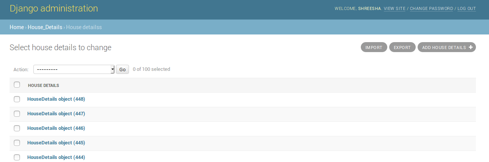

# Django Challenge

## How to Run

```python
python manage.py makemigrations
python manage.py migrate
python manage.py runserver
```

## Data Modelling

The code for data modelling can be found under `./house_details/models.py` I have modelled the data under the assumption that any value can be blank except for **zillow_id**.  

## To ingest the CSV data

This feature can be found at this [endpoint](http://127.0.0.1:8000/admin/house_details/housedetails/).  

I've used [django-import-export](https://django-import-export.readthedocs.io/en/latest/) library to allow admin to
upload a CSV file, to import the data into a database, which can be queried later on. Code enabling this feature for this can be found at `./house_details/import.html`, `./house_details/resource.py`, `./house_details/admin.py`  


## To view complete data

The complete data can be viewed queried using this [endpoint](http://127.0.0.1:8000/api/). Please upload a CSV or create an entry before trying to view the data. 

## To query the data

The data can be queried using this [endpoint](http://127.0.0.1:8000/api/23/)  
Change the **id** in the url to view a different entry. This has been implemented using django-rest-framework generic views.

## To create a new entry

This can be done at this [endpoint](http://127.0.0.1:8000/api/create/)  
This functionality has been implemented using django-rest-framework generic views.

## API Documentation

API Documentation can be found [here](http://127.0.0.1:8000/docs/)
